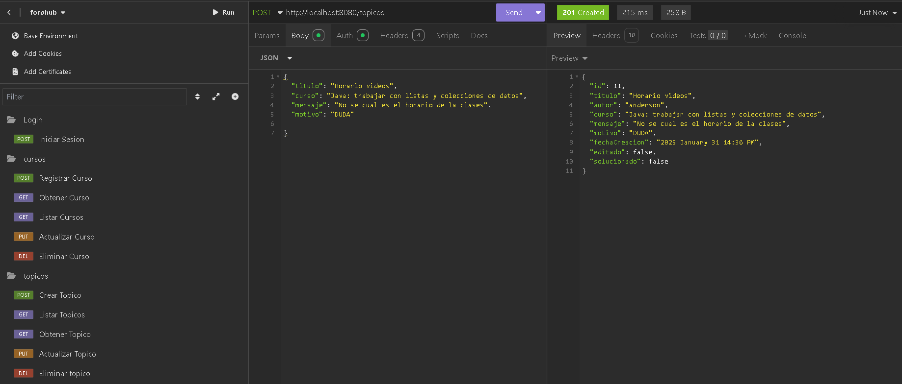
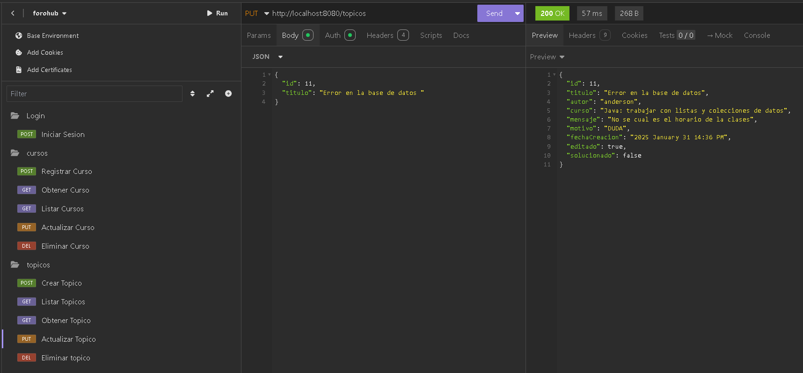
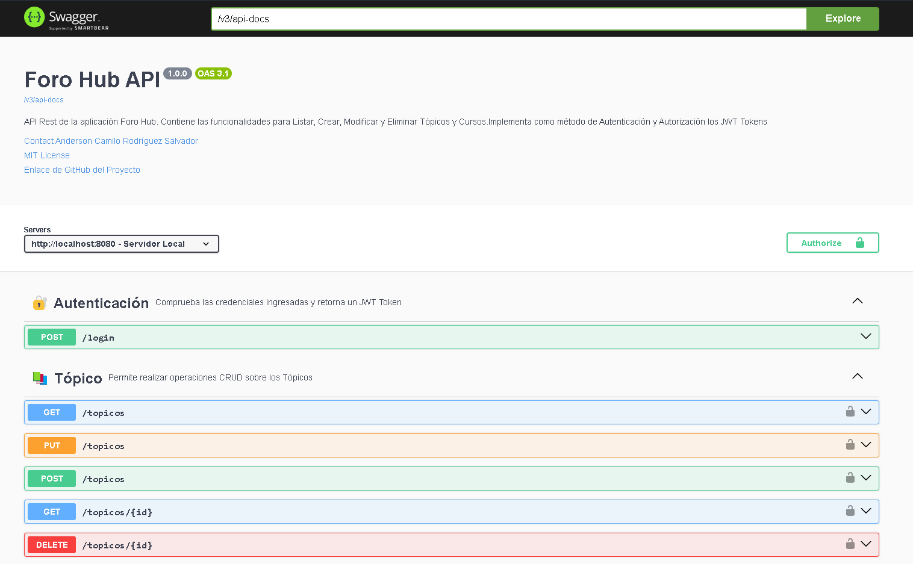
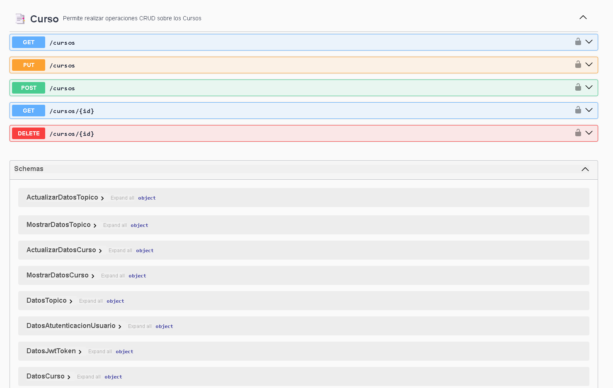

# 📚 Challenge Foro Hub Alura


Este proyecto corresponde al desarrollo del desafío propuesto en el Programa Oracle Next Education en Backend. Este proyecto se enfoca en la creación de una API Rest para la gestión de publicaciones realizadas por los Usuarios en un Foro.

## 🌟 Descripción del Proyecto

Este proyecto tiene como objetivo principal desarrollar una API Rest robusta y eficiente para la gestión de publicaciones en un foro. Entre las características más destacadas se encuentran:

- **Operaciones CRUD**: La API permite realizar operaciones CRUD (Crear, Leer, Actualizar y Eliminar) tanto de las publicaciones en el foro como de los cursos disponibles.
- **Autenticación y Autorización**: Se ha implementado un sistema de autenticación y autorización utilizando JWT (JSON Web Tokens) para garantizar que solo los usuarios autenticados puedan realizar ciertas acciones.
- **Gestión de Publicaciones**: Los usuarios pueden crear, listar, modificar y eliminar publicaciones en el foro, siempre y cuando cumplan con las reglas de negocio establecidas.
- **Gestión de Cursos**: Además de las publicaciones, los usuarios pueden gestionar los cursos disponibles, lo que incluye la capacidad de listar, añadir, modificar y eliminar cursos.
- **Documentación**: La API está documentada utilizando Swagger, lo que facilita a los desarrolladores entender y utilizar los endpoints disponibles.

## 🌟 Conocimientos Aplicados

En este proyecto, se han aplicado los siguientes conocimientos y tecnologías:

- **Java**: Lenguaje de programación utilizado para el desarrollo de la API.
- **Spring Boot**: Framework utilizado para la creación de la API Rest.
- **JWT (JSON Web Tokens)**: Implementado para la autenticación y autorización de los usuarios.
- **JPA (Java Persistence API)**: Utilizado para la gestión de la persistencia de datos.
- **Hibernate**: Framework de mapeo objeto-relacional (ORM) utilizado junto con JPA.
- **PostgreSQL**: Base de datos relacional utilizada para almacenar la información del foro.
- **Swagger**: Utilizado para la documentación de la API.
- **Insomnia**: Herramienta utilizada para probar las peticiones a la API.
- **Lombok**: Biblioteca utilizada para reducir el código.
- **Flyway**: Herramienta utilizada para la migración de la base de datos.

## 🚀 Funcionalidades

La API Rest desarrollada permite a los usuarios realizar las siguientes acciones:

- **Crear POST**: Los usuarios pueden crear publicaciones en el foro siempre y cuando estén autenticados con un JWT Token y el curso al cual está enlazada la publicación exista.
- **Listar todos los POST**: Los usuarios pueden listar todas las publicaciones disponibles en el foro.
- **Listar un POST por ID**: Los usuarios pueden listar una publicación específica proporcionando su ID.
- **Autenticación**: Los usuarios pueden autenticarse para obtener un JWT Token si las credenciales proporcionadas son correctas.

### 📌 Permisos para Modificar y Eliminar Publicaciones

- Los usuarios pueden realizar métodos PUT y DELETE siempre y cuando sean los autores de la publicación que desean modificar o eliminar.

### 🏫 Funcionalidades de Curso

- **Listar Cursos**: Los usuarios pueden listar todos los cursos disponibles.
- **Añadir Curso**: Los usuarios pueden añadir un nuevo curso al sistema.
- **Modificar Curso**: Los usuarios pueden modificar la información de un curso existente.
- **Eliminar Curso**: Los usuarios pueden eliminar un curso del sistema.

## 🛠️ Instalación y Ejecución

Para ejecutar este proyecto en tu entorno local, sigue los siguientes pasos:

1. Clona el repositorio:
   ```sh
   git clone https://github.com/Andersoncrs/Challenge-Foro-Hub-Alura.git
   ```
2. Navega al directorio del proyecto:
   ```sh
   cd Challenge-Foro-Hub-Alura
   ```
3. Configura la base de datos PostgreSQL y actualiza el archivo `application.properties` con tus credenciales y URL de la base de datos.
4. Ejecuta el proyecto.

## 📸 Imágenes de Petición del Cliente (Insomnia)


## 📄 Documentación de la API (Swagger)


## 📢 Contacto

Puedes contactarme a través de los siguientes canales:
- LinkedIn: [Anderson Camilo Rodriguez Salvador](https://www.linkedin.com/in/andersoncrs) 
- Correo Electrónico: andersoncamilo.rodriguez.s@gmail.com

## 📜 Licencia

Este proyecto está licenciado bajo la Licencia MIT.

---

 ⭐ Espero que este proyecto te haya sido de utilidad. ¡Gracias por tu atención! ⭐